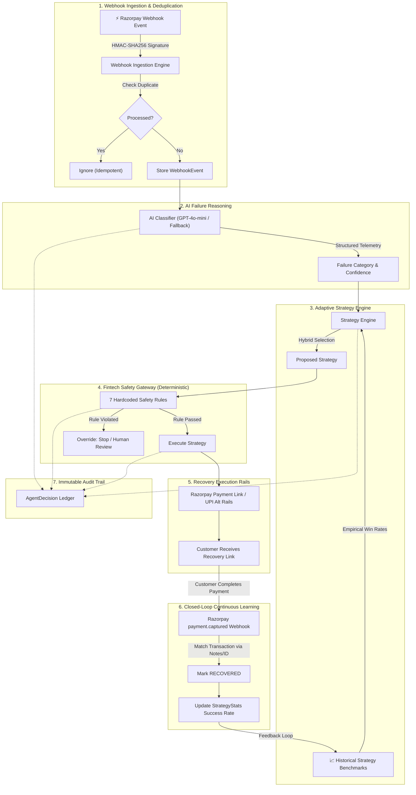

# 🔄 Adaptive Revenue Recovery Agent
> **Autonomous, closed-loop payment recovery for Indian digital commerce — combining AI failure reasoning, deterministic fintech safety rules, and outcome-driven adaptive learning.**

[](https://github.com/karthickvel123/Auto-training-revenue-recovering-ai-model/actions)
[](https://www.python.org/)
[](https://fastapi.tiangolo.com)
[](https://streamlit.io)
[](https://razorpay.com)
[]()
[](LICENSE)
[](https://razorpay.com)

---

## 🎯 The Problem

In Indian digital commerce, **15% to 30% of all payment transactions fail**. Payment gateways (Razorpay, UPI, Cards, Netbanking) generate millions of drop-offs every day due to transient bank switch downtime, OTP timeouts, incorrect user inputs, and temporary limits.

Current merchant recovery systems suffer from four fundamental flaws:
1. **Blind Retries**: Re-attempting payments blindly creates unnecessary transaction fees, congests payment switches, and frustrates customers.
2. **Fraud & Chargeback Liability**: Retrying transactions flagged for risk or stolen instruments violates card network compliance.
3. **Static, Rigid Rules**: Hardcoded retry schedules (e.g. "retry in 1 hour") fail to adapt when specific payment rails or issuer banks are degraded.
4. **No Closed-Loop Learning**: Traditional recovery systems never learn which recovery strategies actually result in captured revenue for specific failure types.

---

## 💡 The Solution: Autonomous Adaptive Revenue Recovery

The **Adaptive Revenue Recovery Agent** introduces an intelligent, closed-loop recovery framework specifically built for Razorpay and Indian payment rails:

- 🧠 **AI Failure Reasoning**: Deconstructs raw Razorpay webhook error codes (`error_code`, `error_reason`, `error_step`, `error_source`) to classify root causes into `temporary`, `customer_action`, `permanent`, or `security`.
- 📊 **Outcome-Driven Adaptive Strategy Selection**: Replaces static rules with an empirical learning loop. The agent tracks recovery conversion rates across failure categories and automatically promotes the highest-converting strategy.
- 🛡️ **7 Deterministic Fintech Safety Rules**: An un-bypassable deterministic safety gateway sits between AI decisions and recovery execution, preventing runaway retries, fraud risks, and duplicate customer nudges.
- 📶 **Smart Multi-Tier Escalation Engine**: Autonomously manages the lifecycle of recovery attempts (Level 1: Smart Payment Link → Level 2: Alternative UPI Rails → Level 3: Human Review Queue).
- ⚡ **Zero-Friction Consumer Storefront (VoltStore)**: An interactive consumer shopping experience with 1-click failure simulation and instant recovery banner.
- 🎛️ **Merchant Operations Cockpit**: A 6-tab Streamlit operations dashboard offering real-time telemetry, failure heatmaps, strategy performance graphs, and an immutable audit trail.

---

## 🏗️ System Architecture



---

## 🛡️ The 7 Deterministic Fintech Safety Rules

Safety in payment systems cannot rely purely on probabilistic LLMs. The **Fintech Safety Gateway** enforces 7 unyielding rules that override AI recommendations whenever safety constraints are triggered:

| # | Rule Name | Trigger Condition | Enforcement Action | Rationale |
|---|---|---|---|---|
| **1** | **Security Block** | `failure_category == "security"` | **STOP (Blocked)** | Never retry suspected fraud or compromised cards |
| **2** | **Permanent Block** | `failure_category == "permanent"` on retry/link | **STOP (Blocked)** | Do not retry closed bank accounts or invalid card numbers |
| **3** | **Max Retries Cap** | `recovery_attempt_count >= 3` | **Route to Human Review** | Prevents endless retry loops and customer fatigue |
| **4** | **High-Value Safeguard** | `amount >= ₹10,000` (1,000,000 paise) | **Route to Human Review** | High-value payments require merchant oversight |
| **5** | **Low Confidence Gate** | AI confidence score `< 0.60` | **Route to Human Review** | Ambiguous failures require human operator verification |
| **6** | **Duplicate Nudge Shield** | Active pending recovery attempt exists | **STOP (Blocked)** | Prevents spamming customers with multiple active links |
| **7** | **Fraud Keyword Heuristic** | Error contains "fraud", "risk", "suspicious" | **Route to Human Review** | Catches edge-case risk terms in raw gateway error strings |

---

## 🖥️ Dual User Experience

### 1. ⚡ VoltStore Storefront (`http://localhost:8000/`)
A self-contained e-commerce shopping experience for testing consumer recovery flows:
- **Real Razorpay Checkout**: Complete payment attempts via real Razorpay standard modal (`checkout.js`).
- **1-Click Failure Simulation**: Trigger any of 6 realistic failure scenarios directly from the shopping cart.
- **Floating AI Recovery Banner**: Live polling of backend recovery status displays the AI diagnosis, safety verdict, and payment link in real time.
- **Zero-Friction 1-Click Recovery**: Instant recovery completion that closes the loop and triggers celebration confetti.
- **Zero External Dependencies**: Embedded CSS theme (dark-mode UI) resilient against CDN blocks or ad blockers.

### 2. 🎛️ Merchant Operations Cockpit (`http://localhost:8501/`)
A 6-tab Streamlit dashboard providing real-time visibility and control:
- **Tab 1: Live Demo & Simulation**: Step-by-step interactive demo panel with modal launch and instant webhook triggers.
- **Tab 2: Transactions Ledger**: Live transaction filterable by payment status (`CAPTURED`, `FAILED`, `RECOVERED`).
- **Tab 3: Transaction Deep Dive**: Granular telemetry inspection of any payment (gateway error, AI analysis, safety checks).
- **Tab 4: Adaptive Strategy Performance**: Interactive Plotly conversion charts showing real-time win rates by strategy and failure category, with a **Seed Demo Data** button.
- **Tab 5: Failure Analytics & Insights**: Automated heatmap of payment failure density (Day-of-Week vs Hour-of-Day) and generative AI diagnostic reports.
- **Tab 6: Agent Audit Log**: Immutable step-by-step decision log (`classification`, `strategy`, `safety`, `action`).

---

## 🚀 Quickstart Guide

### Option A: Run with Docker Compose (Recommended)
Launch both the FastAPI backend and Streamlit dashboard with a single command:

```bash
# 1. Clone repository
git clone https://github.com/karthickvel123/Auto-training-revenue-recovering-ai-model.git
cd Auto-training-revenue-recovering-ai-model

# 2. Launch containerized services
docker compose up --build
```
- **Consumer Storefront & API**: [http://localhost:8000/](http://localhost:8000/)
- **Merchant Operations Dashboard**: [http://localhost:8501/](http://localhost:8501/)

---

### Option B: Local Python Setup

#### 1. Prerequisites
- Python 3.11, 3.12, or 3.13
- Git

#### 2. Setup Virtual Environment
```bash
git clone https://github.com/karthickvel123/Auto-training-revenue-recovering-ai-model.git
cd Auto-training-revenue-recovering-ai-model

python -m venv .venv
# Windows:
.venv\Scripts\activate
# macOS/Linux:
source .venv/bin/activate

pip install -r requirements.txt
```

#### 3. Configure Environment (Optional)
```bash
cp .env.example .env
```
> 💡 **Zero-Key Simulation Mode**: You can run and evaluate the **entire application** without entering Razorpay or OpenAI API keys! The built-in deterministic fallbacks and synthetic gateway client handle all operations seamlessly. To use live Razorpay Test Mode keys, simply enter them in the dashboard sidebar or `.env`.

#### 4. Launch Services
**Terminal 1 (Backend & Storefront):**
```bash
uvicorn backend.main:app --reload --host 0.0.0.0 --port 8000
```

**Terminal 2 (Merchant Dashboard):**
```bash
streamlit run dashboard/app.py --server.port 8501
```

*Or double-click `START_STOREFRONT.bat` and `START_DASHBOARD.bat` on Windows.*

---

## 🧪 Automated Testing & Verification

The test suite contains **62 automated unit and integration tests** verifying every layer of the architecture:

```bash
pytest tests/ -v --tb=short
```

### Test Suite Breakdown
| Test Module | Tests | Description |
|---|:---:|---|
| `tests/test_safety.py` | 11 | Exercises all 7 deterministic fintech safety rules |
| `tests/test_strategy.py` | 8 | Validates cold start, data-driven overrides, and constraints |
| `tests/test_classifier.py` | 14 | Verifies deterministic fallback classification and Pydantic schemas |
| `tests/test_learning.py` | 7 | Verifies strategy win rate tracking, upserts, and amount calculations |
| `tests/test_recovery.py` | 6 | Tests payment link generation, note embedding, and error handling |
| `tests/test_escalation.py` | 5 | Tests multi-tier level escalation (Level 1 → Level 2 → Level 3) |
| `tests/test_webhook.py` | 6 | Tests HMAC-SHA256 signature verification and event ingestion |
| `tests/test_agent.py` | 5 | End-to-end integration tests for complete agent pipeline |
| **Total** | **62** | **100% Pass Rate** |

---

## 🎬 3-Minute Demo Walkthrough for Evaluators

1. **Open the Storefront**: Navigate to [http://localhost:8000/](http://localhost:8000/).
2. **Simulate a Payment Failure**: Click "Add to Cart" on any product, choose a simulated failure reason (e.g. *Customer Action: Insufficient Funds*), and click **⚡ Simulate Payment Failure**.
3. **Watch the AI Recovery Banner**: Within seconds, the floating banner displays:
   - AI Diagnosis: `CUSTOMER ACTION`
   - Safety Gate: `✓ Allowed (All 7 Rules Pass)`
   - Strategy: `PAYMENT LINK`
4. **Complete Recovery**: Click **⚡ Complete Recovery Payment (1-Click)** on the banner.
5. **Inspect the Merchant Dashboard**: Open [http://localhost:8501/](http://localhost:8501/):
   - Check **Tab 1**: Notice the balloons and recovery confirmation!
   - Check **Tab 3**: Inspect the granular decision trace.
   - Check **Tab 4**: Observe how the strategy recovery rate automatically increased.
   - Click **🌱 Seed Demo Data** in Tab 4 to immediately populate 50 historical transactions and see the full analytics charts!
   - Check **Tab 5**: View the failure pattern heatmap across hours and days.
   - Check **Tab 6**: View the complete, immutable agent audit log.

---

## 📂 Repository Structure

```text
adaptive-revenue-recovery/
├── .github/
│   └── workflows/
│       └── ci.yml                 # GitHub Actions CI workflow (Python 3.11, 3.12)
├── backend/
│   ├── static/
│   │   └── store.html             # VoltStore customer-facing e-commerce storefront
│   ├── agent.py                   # Central orchestrator pipeline
│   ├── api_routes.py              # REST API (metrics, simulation, data seeding)
│   ├── classifier.py              # AI failure classifier (OpenAI + deterministic fallback)
│   ├── config.py                  # Pydantic settings & safety thresholds
│   ├── database.py                # SQLAlchemy engine with SQLite WAL pragmas
│   ├── escalation_engine.py       # 3-tier time-based recovery escalation
│   ├── insights_engine.py         # Failure pattern heatmap & generative insights
│   ├── learning_engine.py         # Outcome-driven continuous learning loop
│   ├── main.py                    # FastAPI app entrypoint & background scheduler
│   ├── models.py                  # SQLAlchemy 2.0 ORM models
│   ├── razorpay_client.py         # Razorpay SDK wrapper with graceful offline fallback
│   ├── recovery_engine.py         # Recovery strategy executors (Payment Links, UPI)
│   ├── safety_gateway.py          # 7 deterministic fintech safety rules
│   ├── schemas.py                 # Pydantic v2 schemas and validation models
│   ├── simulator.py               # Demo order generator and status fetcher
│   └── webhook.py                 # Razorpay HMAC-SHA256 signature verification
├── dashboard/
│   └── app.py                     # 6-tab Streamlit merchant operations dashboard
├── tests/
│   ├── conftest.py                # Shared pytest fixtures with in-memory SQLite
│   ├── test_agent.py              # End-to-end agent integration tests
│   ├── test_classifier.py         # AI classifier & fallback tests
│   ├── test_escalation.py         # Multi-tier escalation tests
│   ├── test_learning.py           # Closed-loop learning engine tests
│   ├── test_recovery.py           # Recovery executor tests
│   ├── test_safety.py             # 7 deterministic safety rules tests
│   ├── test_strategy.py           # Adaptive strategy engine tests
│   └── test_webhook.py            # Webhook HMAC verification & ingestion tests
├── .env.example                   # Environment variable template
├── .gitignore                     # Git ignore rules
├── docker-compose.yml             # Single-command multi-container deployment
├── Dockerfile                     # Production container image definition
├── LICENSE                        # MIT License
├── README.md                      # Comprehensive project documentation
└── requirements.txt               # Pinned Python package dependencies
```

---

## ⚖️ Tech Stack

| Domain | Technology | Purpose |
|---|---|---|
| **Backend API** | FastAPI, Uvicorn, Python 3.11+ | High-performance asynchronous REST API |
| **Payment Rails** | Razorpay Python SDK, `checkout.js` | Orders, Payment Links, Webhooks, Signature Verification |
| **Data Persistence** | SQLAlchemy 2.0, SQLite (WAL mode) | Transaction ledger, strategy benchmarks, audit records |
| **Data Validation** | Pydantic v2, Pydantic-Settings | Strict schemas and type safety |
| **Intelligence** | OpenAI GPT-4o-mini + Rule-Based Engine | Root-cause classification and operational insights |
| **Storefront** | HTML5, CSS3 (embedded dark theme), JS | Consumer e-commerce shopping experience |
| **Operations Cockpit** | Streamlit, Plotly, Pandas | Live merchant telemetry, heatmaps, and audit logs |
| **Containerization** | Docker, Docker Compose | Reproducible, isolated multi-service deployment |
| **CI/CD** | GitHub Actions | Automated multi-version testing on push & PR |

---

## 🏆 Razorpay AI Builders Hackathon Submission

- **Author**: Karthick Vel ([@karthickvel123](https://github.com/karthickvel123))
- **Email**: karthivel875@gmail.com
- **Repository**: [https://github.com/karthickvel123/Auto-training-revenue-recovering-ai-model.git](https://github.com/karthickvel123/Auto-training-revenue-recovering-ai-model.git)
- **License**: [MIT](LICENSE)
