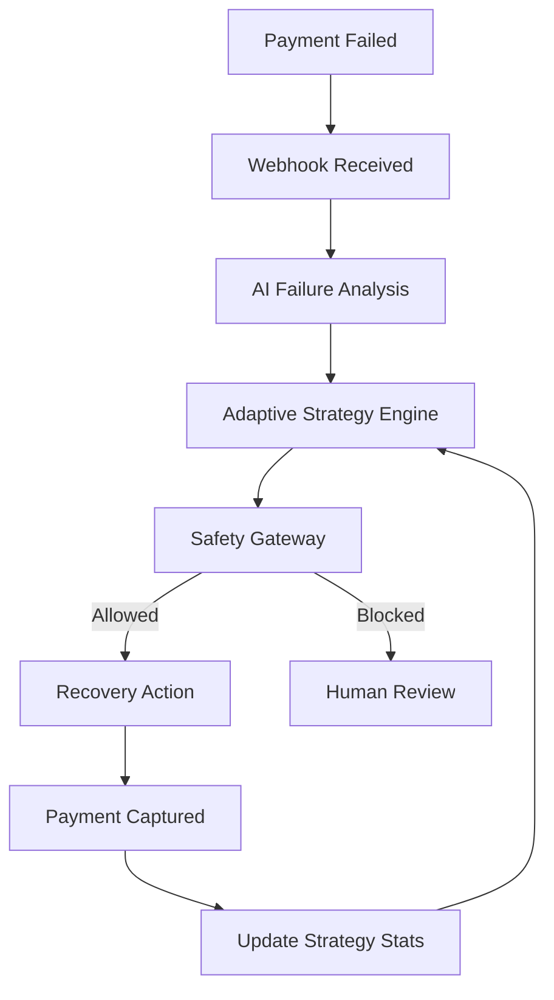

# 🔄 Adaptive Revenue Recovery Agent
AI-powered payment recovery that learns which strategies work best.

## The Problem
Retrying failed payments blindly is a bad idea:
- Not all failures are retryable (e.g., permanent block).
- Retrying fraud increases liability.
- Using the same strategy for different failure types wastes resources and annoys users.
- Traditional systems don't learn from past outcomes.

## The Solution
An adaptive approach that intelligently recovers revenue:
- **AI Classification**: AI classifies the nature of each failure.
- **Outcome-driven Strategy**: Historical outcomes drive strategy selection (e.g. if SMS links work 40% of the time, the agent will learn this).
- **Deterministic Safety**: Safety rules override AI to prevent runaway retries or fraud liability.
- **Continuous Learning**: The system learns from every recovery attempt.

## Architecture


## Key Features
- **Real Razorpay Test Mode integration**: Use live test webhooks.
- **AI failure classification**: Powered by OpenAI GPT-4o-mini.
- **Adaptive strategy engine**: Uses historical data to select the optimal strategy.
- **7 deterministic safety rules**: Blocks runaway behaviors and fraud.
- **Multi-channel smart escalation**: Escalates based on time and failure type.
- **Failure pattern analytics**: Identifies and explains systemic issues.
- **Live demo simulation panel**: Streamlit dashboard to simulate failures in real-time.
- **Full audit trail**: Every decision and action is logged.

## Tech Stack
| Component | Technology |
|---|---|
| Backend | Python, FastAPI |
| Payment Gateway | Razorpay SDK |
| Database | SQLite/SQLAlchemy |
| Intelligence | OpenAI GPT-4o-mini |
| Dashboard | Streamlit, Plotly |

## Setup

1. Clone repo:
```bash
git clone <repo-url>
cd adaptive-revenue-recovery
```

2. Create virtual environment:
```bash
python -m venv venv
venv\Scripts\activate
```

3. Install requirements:
```bash
pip install -r requirements.txt
```

4. Create Razorpay account → enable Test Mode → get Test API keys.

5. Copy `.env.example` to `.env` and fill in keys.

6. Start FastAPI:
```bash
uvicorn backend.main:app --reload --host 0.0.0.0 --port 8000
```

7. Start Streamlit:
```bash
streamlit run dashboard/app.py --server.port 8501
```

8. Start ngrok:
```bash
ngrok http 8000
```

9. Configure webhook in Razorpay Dashboard: `<ngrok_url>/api/webhooks/razorpay`
   - Select Events: `payment.failed`, `payment.authorized`, `payment.captured`

## Environment Variables
Example `.env`:
```env
# Razorpay API Keys (Test Mode)
RAZORPAY_KEY_ID=rzp_test_xxxxxx
RAZORPAY_KEY_SECRET=xxxxxxxxxxxxxxxx

# Webhook Secret (Matches what you set in Razorpay Dashboard)
RAZORPAY_WEBHOOK_SECRET=your_secret_string

# OpenAI
OPENAI_API_KEY=sk-xxxxxx

# Database
DATABASE_URL=sqlite:///./recovery.db
```

## Webhook Setup
1. Launch ngrok: `ngrok http 8000`
2. Copy the `Forwarding` URL.
3. In Razorpay Dashboard -> Account & Settings -> Webhooks -> Add New Webhook.
4. Set Webhook URL to `<ngrok-url>/api/webhooks/razorpay`.
5. Enter the `RAZORPAY_WEBHOOK_SECRET`.
6. Select active events (`payment.failed`, `payment.captured`).

## Testing Failed Payments
Use Razorpay's test mode to simulate failed payments:
- For UPI, use `failure@razorpay`.
- For Cards, select the mock bank page and click the "Failure" button.
- Official Razorpay docs: [Test Integration](https://razorpay.com/docs/payments/payments/test-integration/)

## Demo Walkthrough
1. Open the Streamlit dashboard at http://localhost:8501.
2. Go to the "🔴 Live Demo" tab.
3. Enter an amount and click "Simulate Failed Payment".
4. Copy the Order ID.
5. Go to Razorpay Test Mode, create a payment using this Order ID.
6. Trigger a failure on the Razorpay test bank page.
7. The Streamlit dashboard will automatically update via polling!
8. See the AI classify the error, apply a safety rule, and issue a recovery strategy.
9. Click the provided payment link and complete the payment successfully.
10. Watch the learning loop update its internal statistics!

## How the Learning Loop Works
When a payment fails with `insufficient_funds`, the AI might recommend `payment_link`. If the user completes the payment, the stats for `insufficient_funds` + `payment_link` are updated. 
The next time this error occurs, the system knows that `payment_link` works X% of the time, whereas `immediate_retry` might only work Y% of the time. The highest success rate strategy wins!

## Safety Rules
| Rule | Description | Action |
|---|---|---|
| Security Block | Category is 'security' or error contains 'fraud' | Blocked |
| Permanent Block | Category is 'permanent' and strategy is retry/link | Blocked |
| Max Retries | Exceeds 3 recovery attempts | Blocked |
| High Value | Amount >= ₹10,000 | Human Review |
| Low Confidence | AI confidence < 60% | Blocked |
| Duplicate Nudge | Active pending recovery exists | Blocked |
| Safe Pass | Normal customer error | Allowed |

## Running Tests
```bash
pytest tests/ -v
```

## Project Structure
```text
adaptive-revenue-recovery/
├── backend/
│   ├── main.py
│   ├── database.py
│   └── ...
├── dashboard/
│   └── app.py
├── tests/
│   ├── test_webhook.py
│   ├── test_classifier.py
│   ├── test_strategy.py
│   ├── test_safety.py
│   ├── test_recovery.py
│   ├── test_escalation.py
│   └── test_learning.py
├── .env.example
├── README.md
└── requirements.txt
```

## License
MIT
